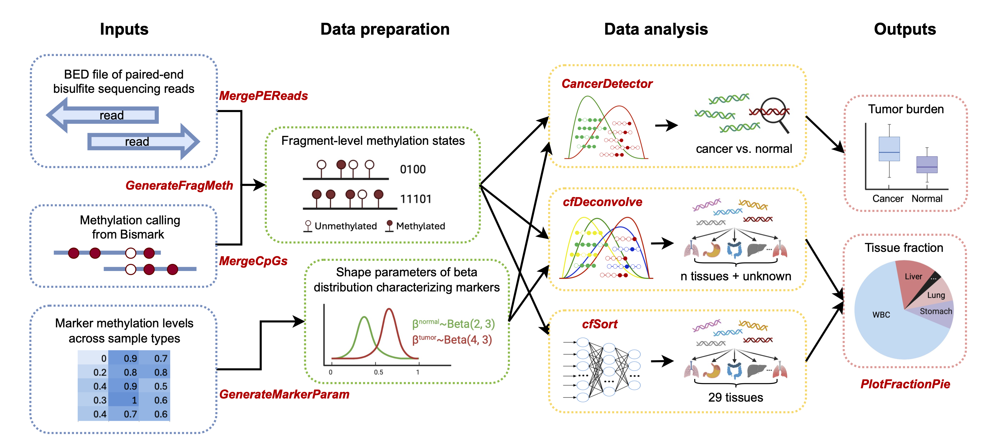

# cfTools: an R/Bioconductor package for deconvolving cell-free DNA via methylation analysis

We developed the R/Bioconductor package cfTools to deconvolve cfDNA from diseased or normal tissues using DNA methylation profiles. cfTools offers a streamlined workflow for sensitive cancer detection and tissue deconvolution, which can be applied in a broad range of clinical applications involving cfDNA-based diagnosis, prognosis and disease monitoring for cancer and other conditions.



## Introduction

cfTools is an R/Bioconductor package that provides a seamless workflow from standard Bismark-processed files to downstream deconvolution functions that decipher cfDNA tissue-of-origin based on methylation profiles. Through the analysis of methylation patterns of tumor or tissue reference markers at the individual DNA fragment level, cfTools calculates the proportions of cfDNA fragments derived from tumor or normal tissues, thereby informing the global tissue composition of plasma cfDNA. 

To distinguish tumor-derived cfDNA from background fragments and estimate tumor burden, it provides the `CancerDetector` function. To deconvolve multiple tissue types and quantify the tissue composition of cfDNA, it provides two functions. One is `cfDeconvolve`, which is an unsupervised probabilistic approach that can incorporate any user-defined methylation markers and various types of methylation data. The other function is `cfSort`, a supervised deep learning-based pretrained model designed to work with predetermined methylation markers of 29 tissue types and cfDNA methylome sequencing data, such as Whole Genome Bisulfite Sequencing (WGBS) and cfDNA Methylome Sequencing (cfMethyl-Seq) data. While the supervised method offers enhanced accuracy with predefined markers, the unsupervised method provides greater flexibility by accommodating user-specified markers and an unknown tissue type but may not achieve the same level of precision. In addition, to facilitate the use of cfTools, we created the cfToolsData package that offers users access to reference marker files, which encompasses DNA methylation marker information for four cancer types (colon, liver, lung, and stomach cancer) and 29 primary human tissue types. Featuring user-customizable options, cfTools and cfToolsData facilitate the straightforward extraction of biologically meaningful information from standard preprocessed sequencing data, accommodating a wide range of clinical applications such as disease diagnosis, prognosis, and monitoring.

## Installation

`cfTools` is an `R` package available via the [Bioconductor](http://bioconductor.org) repository for packages. You can install the release version by using the following commands in your `R` session:

```
if (!requireNamespace("BiocManager", quietly = TRUE)) {
    install.packages("BiocManager")
}
BiocManager::install("cfTools")
```

Alternatively, you can install the development version from [GitHub](https://github.com/) :

```
BiocManager::install("jasminezhoulab/cfTools")
```

## Documentation

See the detailed documentation for `cfTools` using the following commands in your `R` session
```
browseVignettes("cfTools")
```

## Citation

If you use `cfTools` in your research, please cite the following paper:
> Hu, R., Li, S., Stackpole, M. L., Li, Q., Zhou, X. J., & Li, W. (2025). cfTools: an R/Bioconductor package for deconvolving cell-free DNA via methylation analysis. *Bioinformatics Advances*, vbaf108. https://doi.org/10.1093/bioadv/vbaf108